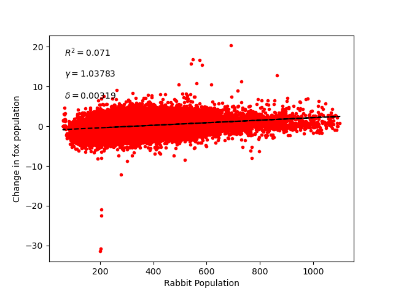
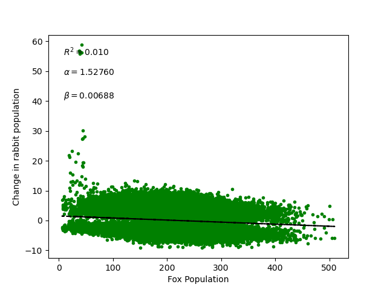
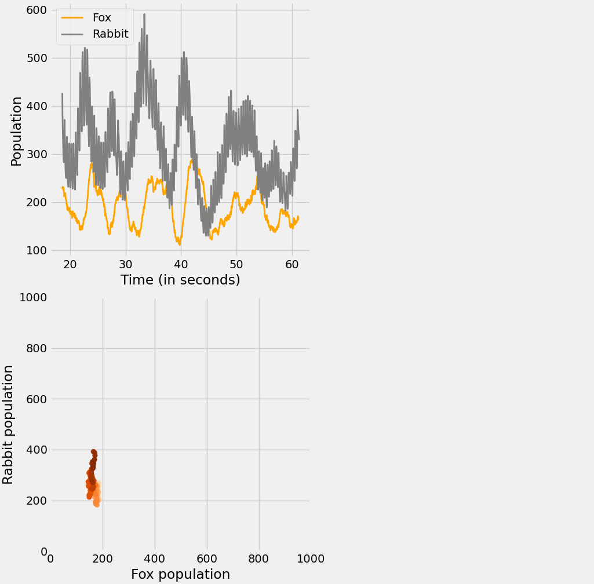
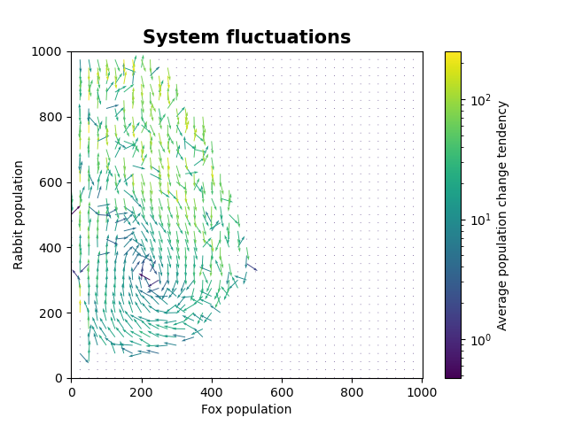

# Cellular automata simulation of Lotka–Volterra population model

## Project introduction:
For our project, we have prepared a program with a visual simulation of a simple ecosystem and built additional functionalities around it. The project features an interactive GUI wherein parameters may be adjusted before running the simulation. Moreover, inside the GUI appears a real-time rendered plot which displays the population of the objects included.

### Why have we chosen this particular topic?

 We wanted to test out the capabilities of computers to fabricate ecosystems - in our example, a really trivial one. Moreover, ecologists lack clean, real-world data on a large enough scale to derive idealised mathematical models able to grasp mass population variations. Heavy computer simulations, due to their ability to create large, parallel processes and easy access to data, might give insight into many real-life problems.

In our simple example, focus is placed on prey-predator population tendencies 
described by Lotka-Volterra equations [1]. More in "Results and Discussion" section.

## Technologies used:

- C++ 20:
    - [Nlohmann json](https://github.com/nlohmann/json)
    - [Raylib](https://www.raylib.com/)
- Python:
    - [matplotlib](https://matplotlib.org/)

### Why C++?
C++ was chosen as the language for the simulation due to its extraordinary speed and computational power when compared to Python. Its speed has allowed us to carry out the simulation with a large number of cells. Furthermore, it has also made it possible to visualise the cells moving around with the use of the Raylib library. Moreover, C++ is a language that not only is taught here at the UJ, but it is also a language that both of us have experience in. 
### Why Python?
Python is a go-to option when it comes to programming GUIs with plotting embedded. Although Raylib is efficient and gives a lot of flexibility, programming a GUI in C++ is pure Spartan work, and is not necessary to meet our needs. Thus said, we have chosen Tkinter, an easy-to-use built-in Python library, coupled with matplotlib.

## Setup

### Runtime requirements

The Python GUI requires:
- Python ≥ 3.8
- matplotlib

Install python dependecies:

#### Ubuntu/Debian:
``` bash
sudo apt-get install python3 python3-matplotlib.
```
#### Arch:
``` bash
sudo pacman -S python python-matplotlib
```
#### Windows:

Install Python from https://www.python.org

Then:
``` bash
pip install matplotlib
```

``` bash
cd path/to/directory/BT4BR-Final-Project/c++_simulation
python run.py
```

## Manual compilation

Required to compile the C++ simulation:
- C++ compiler with C++20 support (ex. g++)
- CMake ≥ 4.00
- X11 and OpenGL development libraries (required by raylib)

Should you require to manually compile the C++ program yourself you may do so by doing the following:

### Linux (tested on Arch)

``` bash
cd path/to/directory/BT4BR-Final-Project/c++_simulation
mkdir build
cd build
cmake ..
cmake --build .
mv ./simulation ../simulation
cd ..
```

Furthermore, Linux users need to download the following libraries for the program to compile properly:

Ubuntu/Debian:
```bash
sudo apt install cmake g++ libx11-dev libxrandr-dev libxinerama-dev libxcursor-dev libxi-dev mesa-common-dev
```
Arch:
```bash
sudo pacman -S cmake gcc libx11 libxrandr libxinerama libxcursor libxi mesa
```

## Program explanation:

### Settings:
Grid size [integer, 10-180]: Changes the number of cells per row to the selected value. 

- Tick duration [float, 0.01-0.5]: Sets the duration, in seconds, of each tick to the selected value.

  _Warning: low values (ex. 0.01) may cause the program to run unevenly_

- Number of foxes [integer, 0-100]: Sets the starting number of foxes.

- Number of rabbits [integer, 0-200]: Sets the starting number of rabbits.

- Grass amount [integer, 1-200]: Sets the starting grass amount.

  _Warning: if there is no place to instantiate a new object, it won't be created_
  
- Include grass [Boolean]: Include grass or not.

  _Warning: By default, it is disabled, which means that rabbits don't need grass to reproduce - grass is meant to be abundant. Enabling it may be resource-intensive_

- Density [integer, 3-10]: Objects need personal space. When the number of objects surrounding meets the density value, they are destroyed.

- Grass growth rate [integer, 2-20]: Sets the grass spreading speed

### Object behavior:
Every object has its own place on the grid and acts every tick, with the order determined by a randomisation algorithm. This action may cause objects to move, reproduce and consume simultaneously.
- How do objects move?
    - Foxes: choose a random surrounding cell (24 cells) if unprovoked by a rabbit, and move if the place is vacant.
    - Rabbits: choose a random surrounding cell (8 cells) if unprovoked by a fox, and move if the place is vacant.
    - Grass: read "Why our project is flawed" section in "Results and discussion"
- How do objects reproduce?
    - Every object has a few variables, these are of the utmost importance:
        - saturation - represents the amount of food the object has eaten. Every object starts at 0.
        - reproduction saturation - saturation that makes an object attempt reproduction.
        - saturation per food - saturation points that are added after food is eaten.
        - saturation per tick - saturation points that are added/subtracted per tick. For the type of object that is last in the food chain, it should be a positive number to simulate an abundance of food.
        - saturation per reproduction - saturation points that are subtracted after reproduction.
        - minimum saturation - saturation at which an object dies. Should be negative.

- How do objects consume other objects?
    - Foxes: check if a rabbit is on a surrounding cell (8 cells), if there is, it moves to this place and the rabbit object is destroyed.
    - Rabbits: check if grass is on a surrounding cell (8 cells), if there is, it moves to this place and the grass object is destroyed.
## Results and discussion:
To test the capabilities of our program, we have run the simulation several times and observed certain constants. LotkaVolterra.py was made to visualise the overall behavior of the processes. In order to run it, step into the proper directory. 
``` bash
cd path/to/directory/BT4BR-Final-Project/c++_simulation
```
And type the following command in the console:
``` bash
python LotkaVolterra.py
```
Depending on what *.csv files are inside BT4BR-Final-Project/c++_simulation/dataLotkaVolterra, the program will create a plot accordingly.

In the example provided, BT4BR-Final-Project/c++_simulation/dataLotkaVolterra contains 4 .csv files with collected data that:
-  lasts around 450 seconds
-  with settings used:
    - grid size = 120
    - rabbits start amount = 70
    - fox start amount = 35
    - density = 5
- and respective seeds: 717277385, 3351555370, 1945957692, 1401806454

### Results:
Our program generated the data allowing for the following plots to be created. They have been created using the data from the dataLotkaVolterra directory.




Due to the stochastic nature of the simulation the R^2 value is noticibly low. However, despite the low values, the parameters correctly capture the structure of the Lotka-Volterra model.

These plots showcase the approximate tendency of change in population in prey and predators respectively, given by the equations:


### $\frac{\mathrm{d} y}{\mathrm{d} t} = \delta xy - \gamma y$
### $\frac{\mathrm{d} x}{\mathrm{d} t} = \alpha x - \beta xy$

With some simple transformations we can calculate the following relationship:

### $\frac{\mathrm{d} y}{\mathrm{d} x} = -\frac{y}{x}\frac{\delta x - \gamma}{\beta y - \alpha}$

### $\frac{\beta y - \alpha}{y} \mathrm{d} y + \frac{\delta x - \gamma}{x} \mathrm{d} x = 0$

After integrating:

### $V = \delta x - \gamma \ln(x) + \beta y - \alpha \ln(y)$

Where:
- **x** is the population density of prey
- **y** is the population density of a predator
- **α** is the maximum prey per capita growth rate 
- **β** is the effect of the presence of predators on the prey death rate
- **γ** is the predator's per capita death rate
- **δ** is the effect of the presence of prey on the predator's growth rate

We can also see that this tendency is showcased on an example plot plotted at runtime with the data in c++_simulation/data/data_example.csv.



With the above, it is clear to see the relationship between pray and predator: the more predators there are, the less prey there is and the more prey there is, the more predators there are.



The plot presents the approximation model, which answers the question of how the populations will change in the next unit of time, based on the current state of the system.

The tendency is visible, every point on the plot wanders, revolving clock-wise around the centre, sometimes it fluctuates, changing the radius.


### Why our project is flawed:
#### Cellular automata
Cellular automata, although easy to visualise and perform calculations on, is a huge simplification. Rules that we have chosen arbitrarily may also be adjusted in a way that doesn't meet our assumptions.
#### Reproduction system doesn't align with "only simple rules" principle.
The reproduction system was rewritten multiple times, adding new parts of code, but not revamping the entire system. Like applying sewing patches on worn-out clothes until they become only patches. This does not make it possible to explain object behavior in one sentence using simple terms. It is especially visible in grass behavior that was programmed quickly and haphazardly without any strict plan in mind.
#### Chaos
Randomisation algorithms cause the simulation to look undetermined and chaotic (in a good way), but cellular automata should mostly be based on strict deterministic rules to easily follow extrapolations from small scale to large scale. It is also important for reproducibility reasons.
#### Bad file management
Bad file management, mostly caused by us, the creators, using completely unlike workflows, separate IDEs and operating systems (Jakub: Visual Studio and VScode on Windows, Bartosz: CLion and PyCharm on Linux) 

The dichotomy described above has also manifested in the code. Every time each of us has been trying to compile a freshly pulled commit, it was full of bugs and compilation errors. This is the reason for using many try/catch, try/except statements and conditional instructions to prevent it. But every cloud has a silver lining. Our program may be successfully run on both Windows and Linux.

### Known bugs:

Windows version of the program isn't the latest and function meant to create setting_used.json file is obsolete.

### AI disclaimer:
We have been using AI LLMs such as ChatGPT in the followng cases:
- Jakub: getting help understanding some compilation errors, *.vcxproj files management and corrections, getting help in building standalone .exe file using Visual Studio.  
- Bartosz: getting help with errors, CMake, and understanding how to derive the Lotka-Volterra equations.

## Contributions:
- Jakub Stach
  - Project Leader
  - Windows support
  - Live plotting
  - Tkinter GUI
  - Quiver plot
  - Actor acting in simulation
- Bartosz Kądziołka
  - Linux support
  - QA
  - JSON support
  - Lotka-Volterra equation derivation
  - Code organisation
- Mysterious KnotSora character
  - is Bartosz
  - GitHub was being weird

Furthemore, both members worked equally on the C++ program.
For more details, look at the commits on GitHub.
Moreover, there exists a more elaborate unfinished version of the simulation in the 'rework-act-method' branch. It is unfinished due to time constraints, however it is equally interesting C++ code wise.
## Further reading and inspirations:

[1] <https://en.wikipedia.org/wiki/Lotka–Volterra_equations>

Insight into real life example:

<https://besjournals.onlinelibrary.wiley.com/doi/10.1111/j.1365-2656.2005.00977.x>

Similar projects:

<http://en.alife.pl/predators-and-prey-the-Lotka-Volterra-model>

<https://youtu.be/sGKiTL_Es9w?si=9HQs78u29Kml01Jf>

A well made video serving as an introduction to the topic by Sum and Product:

<https://www.youtube.com/watch?v=fW_Df8bytIU>


